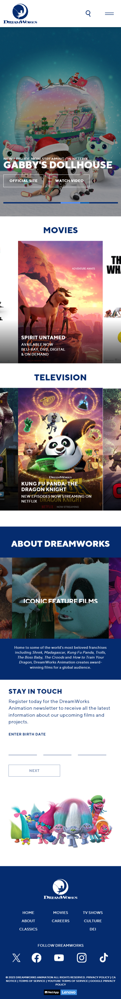
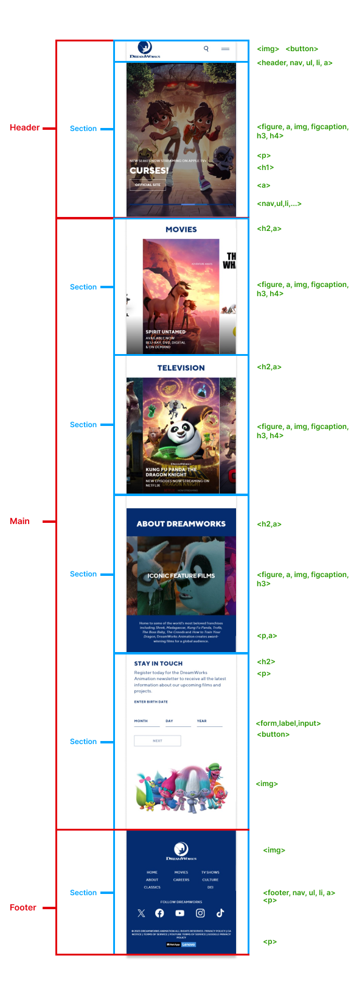
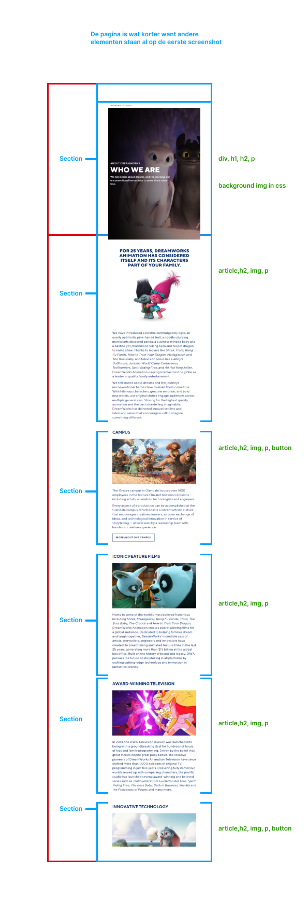
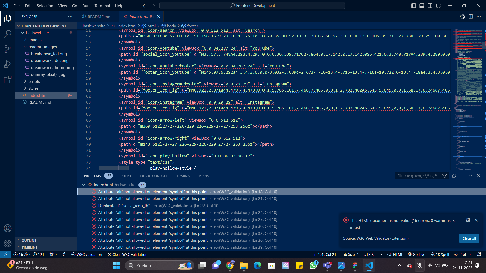
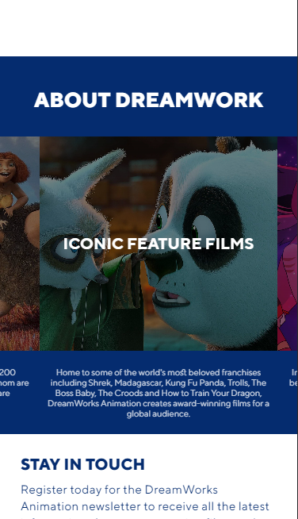
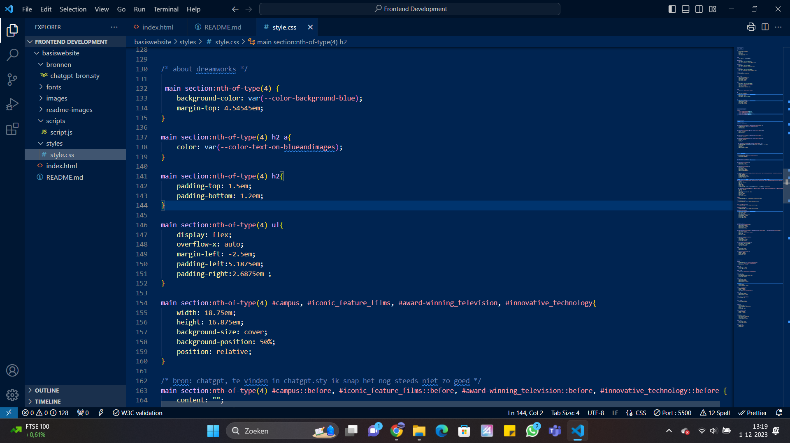
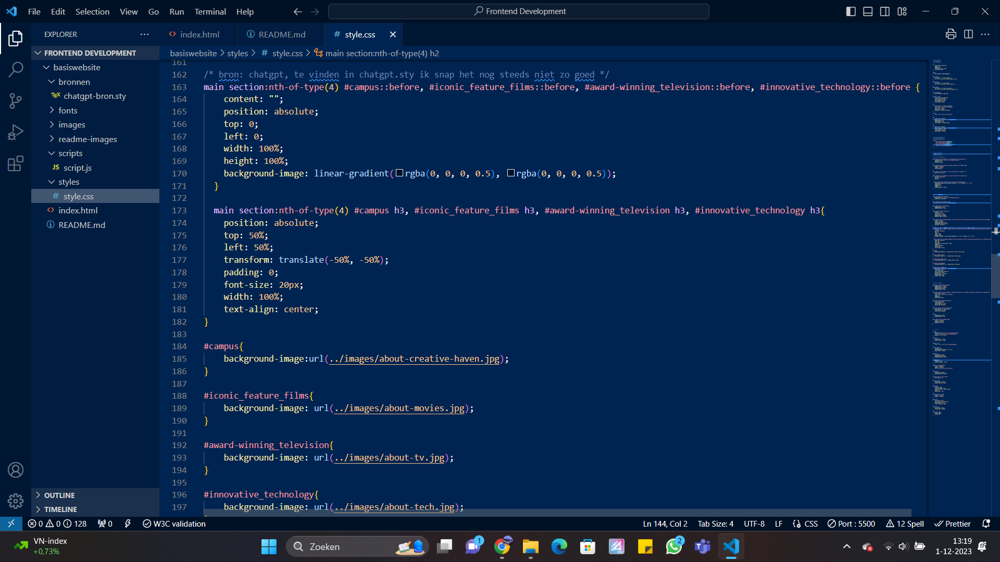
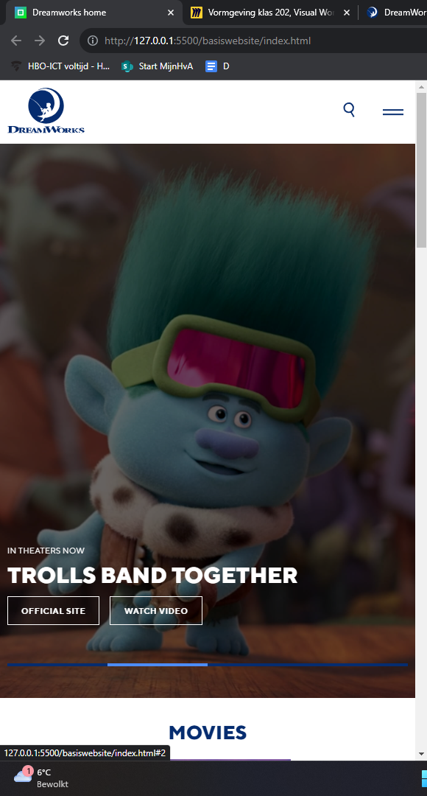
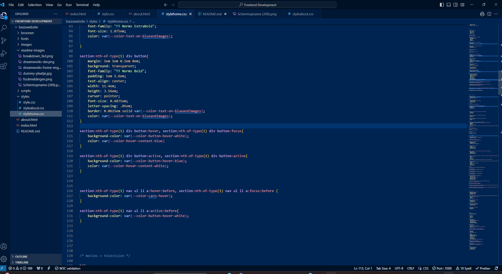

# Procesverslag
Markdown is een simpele manier om HTML te schrijven.  
Markdown cheat cheet: [Hulp bij het schrijven van Markdown](https://github.com/adam-p/markdown-here/wiki/Markdown-Cheatsheet).

Nb. De standaardstructuur en de spartaanse opmaak van de README.md zijn helemaal prima. Het gaat om de inhoud van je procesverslag. Besteedt de tijd voor pracht en praal aan je website.

Nb. Door *open* toe te voegen aan een *details* element kun je deze standaard open zetten. Fijn om dat steeds voor de relevante stuk(ken) te doen.

## Jij

  
uitwerken voor kick-off werkgroep

  ### Auteur:
  Sanne 't Hooft (vervangen door jouw naam)

  #### Je startniveau:
  Rood

  #### Je focus:
  surface plane
 

## Je website

  
uitwerken voor kick-off werkgroep

  ### Je opdracht:
  link naar de website die je gaat namaken óf de naam/omschrijving van je eigen ontwerp:
  https://www.dreamworks.com/
  #### Screenshot(s) van de eerste pagina (small screen): 
  home-page 
  

  #### Screenshot(s) van de tweede pagina (small screen):
  diversity, equity, & inclusion page
  
 

## Toegankelijkheidstest 1/2 (week 1)

  
uitwerken na test in 2e werkgroep

  ### Bevindingen
  Lijst met je bevindingen die in de test naar voren kwamen:

  - Er worden meerdere h1's per pagina gebruikt
  - De tekst van foto's met tekst kan je niet terugvinden in de alt
  - Links zijn soms lastig om te zien, voornamelijk de h2's
  - Op mobiel formaat is er geen focus status voor de navigatie
  - Er is geen dark modus
  - Als je tekst naar 200% zet op mobiel formaat is het amper leesbaar
  - Achtergrond video's kunnen niet gepauzeerd worden
  - Op groot formaat houden niet alle animaties zich aan de reduced motion media query
  - Het contrast van tekst op afbeeldingen is soms niet goed

## Breakdownschets (week 1)

  
uitwerken na afloop 3e werkgroep

  ### de hele pagina: 
  

  ### tweede page: 
  

## Voortgang 1 (week 2)

  
uitwerken voor 1e voortgang

  ### Stand van zaken
  hier dit ging goed & dit was lastig (neem ook screenshots op van delen van je website en code)
  - ik vond het lastig om semantische code te typen, omdat er veel verschillende tags zijn en de elementen van dreamwork
    hebben niet altijd een duidelijk doel, waardoor het lastig is om een tag omheen te zetten.

  -Ik heb veel foutmeldingen in mijn stuk code voor de svg's.
  

  ### Agenda voor meeting
  samen met je groepje opstellen

  Ziggy: Info over svg foutmeldingen
  Ruben: Meer info over responsive design
  Elisa: Persoonlijke check over html
  Leon:  Info over hoe gedetaileerd surface plane
  Jake: -
  

  ### Verslag van meeting
  hier na afloop snel de uitkomsten van de meeting vastleggen

  Ik heb helaas geen antwoord kunnen krijgen op mijn vraag, wel was alles voor de rest goed.

## Voortgang 2 (week 3)

  
uitwerken voor 2e voortgang

  ### Stand van zaken
  hier dit ging goed & dit was lastig (neem ook screenshots op van delen van je website en code)
  - Ik vond het lastig om een goed passende background te geven aan mijn containers in "about dreamworks". Ook lukte het niet helemaal met de flexbox omdat de heading
  wel in de container moest maar de p niet. En tot slot was het lastig om de container een donkere kleur te geven omdat er al een background img in zat, dus hiervoor heb 
  ik een online bron gebruikt.

  
  
  
  
  
  

  ### Agenda voor meeting
  samen met je groepje opstellen

  Ziggy: Info over svg foutmeldingen + oneindig scrollen in een overflow
  Ruben: foto als ul achtergrond + foto carrousel
  Leon:  Schalen van elementen + image overflowen
  Elisa: -
  Jake: -

  ### Verslag van meeting
  hier na afloop snel de uitkomsten van de meeting vastleggen

 Ik ben te weten gekomen dat de foutmeldingen oke zijn en dat een oneidige scroll eigenlijk
 heel overbodig en niet toegankelijk is.

## Toegankelijkheidstest 2/2 (week 4)

  
uitwerken na test in 9e werkgroep

  ### Bevindingen
  Lijst met je bevindingen die in de test naar voren kwamen (geef ook aan wat er verbeterd is):

  ### Bevindingen
  Lijst met je bevindingen die in de test naar voren kwamen:

  - Er worden meerdere h1's per pagina gebruikt (verbeterd)
  - De tekst van foto's met tekst kan je niet terugvinden in de alt (verbeterd)
  - Links zijn soms lastig om te zien, voornamelijk de h2's (verbeterd)
  - Op mobiel formaat is er geen focus status voor de navigatie (verbeterd)
  - Er is geen dark modus (verbeterd)
  - Als je tekst naar 200% zet op mobiel formaat is het amper leesbaar (hetzelfde)
  - Achtergrond video's kunnen niet gepauzeerd worden (ik heb uiteindelijk geen achtergrond video gebruikt)
  - Op groot formaat houden niet alle animaties zich aan de reduced motion media query (niet verbeterd)
  - Het contrast van tekst op afbeeldingen is soms niet goed (hetzelfde)

## Voortgang 3 (week 4)

  
uitwerken voor 3e voortgang

  ### Stand van zaken
  hier dit ging goed & dit was lastig (neem ook screenshots op van delen van je website en code)

  - ik had veel moete met alle states uitwerken, vooral met focus, omdat de tab niet direct mijn gestijlde elementen focussed.
  - ook lukte de carousel niet helemaal, maar in de les werd ik geholpen door de student assisten en toen bleek het dat ik de img niet op 100% widt had gezet

  ### Agenda voor meeting
  samen met je groepje opstellen

  Ziggy: hoe kan ik een image een focus status geven + hoe maak ik een menu met javascript
  Ruben: 
  Leon:  
  Elisa: -
  Jake: -

  ### Verslag van meeting
  hier na afloop snel de uitkomsten van de meeting vastleggen

 ik ben erachter gekomen dat mijn html goed in elkaar zat, hoe ik een menu kan maken met javascript. Ook dat de focus op de img niet belangrijk is.

## Eindgesprek (week 5)

  
uitwerken voor eindgesprek

  ### Je uitkomst - karakteristiek screenshots:
  

  ### Dit ging goed/Heb ik geleerd: 
  Korte omschrijving met plaatjes

  

  ### Dit was lastig/Is niet gelukt:
  Korte omschrijving met plaatjes

  

## Bronnenlijst

  
continu bijhouden terwijl je werkt

  Nb. Wees specifiek ('css-tricks' als bron is bijv. niet specifiek genoeg). 
  Nb. ChatGpT en andere AI horen er ook bij.
  Nb. Vermeld de bronnen ook in je code.

  1. een skiplink, bron: https://www.youtube.com/watch?v=rD3db6-vmuo
  2. een lightbar, techniek uit de les, vormgevign knop bron: https://www.youtube.com/watch?v=S-T9XoCMwt4&t=343s -->

  3. fonts: https://www.onlinewebfonts.com/download/07bc241768c969f6b6a27a7bf0dfb490
  4. light dark toggle https://www.youtube.com/watch?v=S-T9XoCMwt4&t=175s
  5. before en after elementen: https://www.youtube.com/watch?v=zGiirUiWslI
  6. scroll animatie met reduced media query, maar helaas werkt de reduced media niet bron: https://www.youtube.com/watch?v=T33NN_pPeNI
  7. ligh dark functie bron: https://codepen.io/Ziggy23/pen/RwvdBdr

